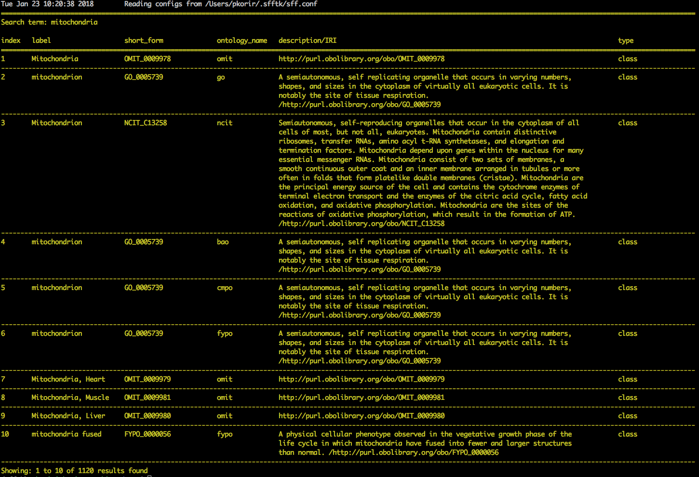

=================================
Annotating EMDB-SFF Segmentations
=================================

.. contents::

Introduction
============

Annotation of EMDB-SFF segmentations is the second core function of ``sfftk``. 
Here we outline how to perform annotations of EMDB-SFF segmentations via the 
command-line.

Annotation is performed using the `notes` utility that is accessed with the 
``notes`` subcommand.

.. code:: bash

    sff notes
    
Annotation Levels: Global vs. Local Notes
-----------------------------------------

Annotations can be added at the segmentation (global) or individual segment 
(local) level. ``sfftk`` distinguishes between both levels of annotations. 
Global notes are 
useful for terms that describe the segmentation as a whole such as the 
species, the tissue type, disease state and such global references. Local 
notes refer to individual segments which may be constituted of multiple 
biological entities of interest. Given the segment relationship specified by 
`parent_id` to `segment_id`, a hierarchy of segments may also be annotated. 
Simply add notes to the segment whose ID you are targetting.

Operations: Find, View, Modify
------------------------------

There are three main operations that a user can perform using the ``notes`` subcommand.

-  **Find** notes from an ontology principally the `Ontology Lookup Service (OLS) hosted at EMBL-EBI <https://www.ebi.ac.uk/ols/index>`_;

-  **View** notes present in an EMDB-SFF file;

-  **Modify** notes in an EMDB-SFF file.

States: FIND, VIEW, MODIFY
--------------------------

Correspondingly, using the notes subcommand puts the user in one of three states: the FIND state, the VIEW state and the MODIFY state. These will be indicated by the colour of the text on the screen.

-  **WHITE** indicates the ``VIEW STATE`` i.e. that no modifications will be done on the EMDB-SFF file

-  **YELLOW** indicates the ``FIND STATE`` i.e. search for terms from `OLS <https://www.ebi.ac.uk/ols/index>`_, and

-  **GREEN** indicates the ``MODIFY STATE`` i.e. that a file is currently being edited. 

.. note::

	Note, viewing the contents of an EMDB-SFF file in the ``MODIFY STATE`` will also appear in green even if a view command is invoked.

The full listing of sub-subcommands organised by operation are:

-  Find

    -   **search**

-  View

    -   **list**

    -   **show**

-  Modify

    -   **add**

    -   **edit**

    -   **copy**

    -   **clear**

    -   **merge**

    -   **del**

    -   **save**

    -   **trash**

We will look at each of these in turn.

Quick Start
-----------

Finding Notes
=============

The search sub-subcommand displays results from searching EMBL-EBI’s OLS. As 
described in `States <#states-find-view-modify>`__, the terminal text is 
coloured yellow.

.. code:: bash

    sff notes search
    sff notes search -h
    sff notes search --help

display available options.

Specifying Search Terms
-----------------------

For single worded searches enter the term with or without quotes. Multi-word 
terms must be quoted to prevent splitting them.

.. code:: bash

    # single word term
    sff notes search mitochondria
    sff notes search ‘mitochondria’
    sff notes search “mitochondria”
    # multi-word term
    sff notes search ‘fragment mitochondria’

The search results are displayed as a table with the following columns:

-  *index*

-  *label* of the result term

-  *short_form*  [1]_ of the result term

-  *ontology_name*

-  *description/IRI* is free text describing the term and IRI refers to a link by which the term in the ontology may be accessed, and

-  *type* can have one of the following values: *class, property, individual, ontology*

Specifying The Ontology To Search
~~~~~~~~~~~~~~~~~~~~~~~~~~~~~~~~~

.. code:: bash

    sff notes search -O <ontology_name> “<term>”
    sff notes search --ontology <ontology_name> “<term>”

See `Listing Available Ontologies <#listing-available-ontologies>`__ on how 
to get an ontology to search.

Performing Exact Searches
~~~~~~~~~~~~~~~~~~~~~~~~~

Exact searches only return results matching the search term *exactly.*

.. code:: bash

    sff notes search -x “<term>”
    sff notes search --exact “<term>”

Including Obsolete Terms
~~~~~~~~~~~~~~~~~~~~~~~~

Some terms are retired and are excluded by default. They can be included using 
the ``-o/--obsoletes`` flag.

.. code:: bash

    sff notes search -o “<term>”
    sff notes search --obsoletes “<term>”

Listing Available Ontologies
----------------------------

.. code:: bash

    sff notes search -L “term”
    sff notes search --list-ontologies “term”

By default this provides a multi-line result for each ontology consisting of 
the *namespace* (also called *ID space*), *preferred prefix, title, 
description, homepage, the ontology ID,* and *version* of the ontology.

Short Listing Of Available Ontologies
~~~~~~~~~~~~~~~~~~~~~~~~~~~~~~~~~~~~~

Alternatively, a simple table result can be displayed using the 
``-l/--short-list-ontologies`` flag which displays only two columns: 
*namespace* and *description.*

.. code:: bash

    sff notes search -l “term”
    sff notes search --short-list-ontologies “term”

Traversing Searching Results
----------------------------

By default, ``sff notes`` search only shows the first page of results. Quite 
often, there will be more than one page of results. This will be evident from 
the last line of the results:

.. code:: bash
	
	Showing: 1 to 10 of 139 results found

Specifying The Start Result
~~~~~~~~~~~~~~~~~~~~~~~~~~~

The user can specify the result index at which results should be displayed 
using the ``-s/--start`` flag.

.. code:: bash

    sff notes search -s 1 “<term>”
    sff notes search --start 1 “<term>”

Specifying The Number Of Rows To Display
~~~~~~~~~~~~~~~~~~~~~~~~~~~~~~~~~~~~~~~~

More results can be display using the ``-r/--rows`` flag.

.. code:: bash

    sff notes search -r 11 “<term>”
    sff notes search --row 11 “<term>”

Entering invalid values for ``-s/--start`` and ``-r/--rows`` raise 
``ValueError`` exceptions.

Viewing Notes
=============

``sfftk`` includes utilities to view annotations (notes) included in EMDB-SFF 
files. There are two main functionalities:

-  `Listing` all notes present using the ``sff notes list`` sub-subcommand, and

-  `Showing` global notes or those in a single segment using the ``sff notes show`` sub-command.

As describe in `States <#states-find-view-modify>`__, the teminal text colour 
when viewing is **WHITE**.

Listing All Notes
-----------------

The **sff notes list** sub-command only lists a summary table of notes 
available for each segment. 

.. code:: bash

    sff notes list file.sff
    sff notes list file.hff
    sff notes list file.json

The default output is structured as follows:

.. code::

    Status information
    ******************
    Segment metatdata
    
Here is an example:

.. code:: bash

	**************************************************************************************************************
	id      parId   description                              #inst #exRf #cplx #macr           colour
	--------------------------------------------------------------------------------------------------------------
	9764    0       GroEL                                        1     7     0     0     (0.8, 0.96, 0.4, 1.0)
	9814    0       GroEL                                        1     7     0     0     (0.8, 0.48, 0.88, 1.0)
	9815    0       GroEL                                        1     7     0     0    (1.0, 0.412, 0.706, 1.0)
	9840    0       GroEL                                        1     7     0     0    (0.16, 0.84, 0.48, 1.0)
	9859    0       GroEL                                        1     7     0     0    (0.92, 0.84, 0.96, 1.0)
	9893    0       GroEL                                        1     7     0     0     (0.0, 0.84, 0.76, 1.0)
	9897    0       GroEL                                        1     7     0     0     (0.0, 0.84, 0.76, 1.0)
	9911    0       GroEL                                        1     7     0     0    (0.92, 0.84, 0.96, 1.0)
	9914    0       GroEL                                        1     7     0     0    (0.16, 0.84, 0.48, 1.0)
	9952    0       GroEL                                        1     7     0     0    (1.0, 0.412, 0.706, 1.0)
	9955    0       GroEL                                        1     7     0     0     (0.8, 0.96, 0.4, 1.0)
	9956    0       GroEL                                        1     7     0     0     (0.8, 0.48, 0.88, 1.0)

It has the following columns:

- *id*: segment ID

- *parId*: segment ID for the parent ID;

- *description*: a descriptive name for the segment, which provides a useful starting point when searching for annotation terms;

- *#inst*: the number of instances of the segment;

- *#exRf*: the number of external references present;

- *#cplx*: the number of complexes associated with the segment;

- *#macr*: the number of macromolecules associated with the segment; and

- *colour*: the colour of the segment in normalised RGBA. 

where the first line provides some status information about the current 
listing. Status messages will become much more important when we look at 
`modifying notes in EMDB-SFF files <#_c0sybxydflf7>`__. Status messages begin 
with a timestamp. Following status messages is the EMDB-SFF header 
information which specifies the schema version (``0.6.0a4``), the name of the 
segmentation (‘STL Segmentation’), software information including processing 
details, the primary descriptor (*meshList* in this case) and additional 
details on this segmentation. A row asterisks then divides the metadata from 
the segment data where one row per segment provides the *segment_id, 
parentID, description, number of instances, number of external references, 
number of complexes, number of macromolecules,* and *RGBA colour* of the 
segment. When modifying notes these values change.

Long Format
~~~~~~~~~~~

To view the list of notes by segment in long format (much more detail) use 
the ``-l/--long-format`` flag. This can be done with or without the header
(``-H/--header`` flag).

.. code:: bash

    sff notes list -l file.sff
    sff notes list --long-format file.sff

having the same

.. code::

    Status information
    ==================
    Segment metatdata

structure except now that the Segment metadata section has much more detail.

.. code::

	**************************************************************************************************************
	ID:		9764
	PARENT ID:	0
	Segment Type:	threeDVolume
	--------------------------------------------------------------------------------------------------------------
	Description:
		GroEL
	Number of instances:
		1
	--------------------------------------------------------------------------------------------------------------
	External references:
		#  ontology_name    iri                                                      short_form           L D
		------------------------------------------------------------------------------------------------------
		0: ogg              http://purl.obolibrary.org/obo/OGG_3000881348            OGG_3000881348       Y N
		1: ogg              http://purl.obolibrary.org/obo/OGG_3001198820            OGG_3001198820       Y N
		2: vo               http://purl.obolibrary.org/obo/VO_0010998                VO_0010998           Y N
		3: vo               http://purl.obolibrary.org/obo/VO_0011075                VO_0011075           Y N
		4: pdro             http://purl.obolibrary.org/obo/VO_0010998                VO_0010998           Y N
		5: pdro             http://purl.obolibrary.org/obo/VO_0011075                VO_0011075           Y N
		6: omit             http://purl.obolibrary.org/obo/OMIT_0001676              OMIT_0001676         Y N
	--------------------------------------------------------------------------------------------------------------
	Complexes:
		-*- NOT DEFINED -*-
	Macromolecules:
		-*- NOT DEFINED -*-
	--------------------------------------------------------------------------------------------------------------
	Colour:
		(0.800000011920929, 0.9599999785423279, 0.4000000059604645, 1.0)
	**************************************************************************************************************
	ID:		9814
	PARENT ID:	0
	Segment Type:	threeDVolume
	--------------------------------------------------------------------------------------------------------------
	Description:
		GroEL
	Number of instances:
		1
	--------------------------------------------------------------------------------------------------------------
	External references:
		#  ontology_name    iri                                                      short_form           L D
		------------------------------------------------------------------------------------------------------
		0: ogg              http://purl.obolibrary.org/obo/OGG_3000881348            OGG_3000881348       Y N
		1: ogg              http://purl.obolibrary.org/obo/OGG_3001198820            OGG_3001198820       Y N
		2: vo               http://purl.obolibrary.org/obo/VO_0010998                VO_0010998           Y N
		3: vo               http://purl.obolibrary.org/obo/VO_0011075                VO_0011075           Y N
		4: pdro             http://purl.obolibrary.org/obo/VO_0010998                VO_0010998           Y N
		5: pdro             http://purl.obolibrary.org/obo/VO_0011075                VO_0011075           Y N
		6: omit             http://purl.obolibrary.org/obo/OMIT_0001676              OMIT_0001676         Y N
	--------------------------------------------------------------------------------------------------------------
	Complexes:
		-*- NOT DEFINED -*-
	Macromolecules:
		-*- NOT DEFINED -*-
	--------------------------------------------------------------------------------------------------------------
	Colour:
		(0.800000011920929, 0.47999998927116394, 0.8799999952316284, 1.0)
	**************************************************************************************************************
	...
	# other segments go here
	...
	**************************************************************************************************************
	ID:		9956
	PARENT ID:	0
	Segment Type:	threeDVolume
	--------------------------------------------------------------------------------------------------------------
	Description:
		GroEL
	Number of instances:
		1
	--------------------------------------------------------------------------------------------------------------
	External references:
		#  ontology_name    iri                                                      short_form           L D
		------------------------------------------------------------------------------------------------------
		0: ogg              http://purl.obolibrary.org/obo/OGG_3000881348            OGG_3000881348       Y N
		1: ogg              http://purl.obolibrary.org/obo/OGG_3001198820            OGG_3001198820       Y N
		2: vo               http://purl.obolibrary.org/obo/VO_0010998                VO_0010998           Y N
		3: vo               http://purl.obolibrary.org/obo/VO_0011075                VO_0011075           Y N
		4: pdro             http://purl.obolibrary.org/obo/VO_0010998                VO_0010998           Y N
		5: pdro             http://purl.obolibrary.org/obo/VO_0011075                VO_0011075           Y N
		6: omit             http://purl.obolibrary.org/obo/OMIT_0001676              OMIT_0001676         Y N
	--------------------------------------------------------------------------------------------------------------
	Complexes:
		-*- NOT DEFINED -*-
	Macromolecules:
		-*- NOT DEFINED -*-
	--------------------------------------------------------------------------------------------------------------
	Colour:
		(0.800000011920929, 0.47999998927116394, 0.8799999952316284, 1.0)

Including Segmentation Metadata
~~~~~~~~~~~~~~~~~~~~~~~~~~~~~~~

By default, segmentation metadata (name, software, global notes, file path, 
details) are not included when listing or showing notes. The ``-H/--header`` 
flag includes this.

.. code:: bash

	sff notes list -H file.sff
	sff notes list --header file.sff
	
The output has the following structure: 

.. code::

    Status information
    ==================
    EMDB-SFF metadata
    ******************
    Segment metatdata
    
And here's an example:

.. code::

	==============================================================================================================
	EMDB-SFF v.0.6.0a4
	--------------------------------------------------------------------------------------------------------------
	Segmentation name:
		Segger Segmentation
	Segmentation software:
		Software: segger
		Version:  2
	Software processing details:
	        -*- NOT DEFINED -*-
	--------------------------------------------------------------------------------------------------------------
	Primary descriptor:
		threeDVolume
	--------------------------------------------------------------------------------------------------------------
	File path:
		/Users/pkorir/Data/segmentations/seg
	--------------------------------------------------------------------------------------------------------------
	Bounding box:
		(0, None, 0, None, 0, None)
	--------------------------------------------------------------------------------------------------------------
	Global external references:
		#  ontology_name    iri                                                      short_form           L D
		------------------------------------------------------------------------------------------------------
		0: ncit             http://purl.obolibrary.org/obo/NCIT_C14206               NCIT_C14206          Y Y
		1: dron             http://purl.obolibrary.org/obo/DRON_00018778             DRON_00018778        Y N
		2: omit             http://purl.obolibrary.org/obo/OMIT_0006157              OMIT_0006157         Y N
		3: ncbitaxon        http://purl.obolibrary.org/obo/NCBITaxon_562             NCBITaxon_562        Y N
	--------------------------------------------------------------------------------------------------------------
	Segmentation details:
		-*- NOT DEFINED -*-
	**************************************************************************************************************
	id      parId   description                              #inst #exRf #cplx #macr           colour
	--------------------------------------------------------------------------------------------------------------
	9764    0       GroEL                                        1     7     0     0     (0.8, 0.96, 0.4, 1.0)
	9814    0       GroEL                                        1     7     0     0     (0.8, 0.48, 0.88, 1.0)
	9815    0       GroEL                                        1     7     0     0    (1.0, 0.412, 0.706, 1.0)
	9840    0       GroEL                                        1     7     0     0    (0.16, 0.84, 0.48, 1.0)
	9859    0       GroEL                                        1     7     0     0    (0.92, 0.84, 0.96, 1.0)
	9893    0       GroEL                                        1     7     0     0     (0.0, 0.84, 0.76, 1.0)
	9897    0       GroEL                                        1     7     0     0     (0.0, 0.84, 0.76, 1.0)
	9911    0       GroEL                                        1     7     0     0    (0.92, 0.84, 0.96, 1.0)
	9914    0       GroEL                                        1     7     0     0    (0.16, 0.84, 0.48, 1.0)
	9952    0       GroEL                                        1     7     0     0    (1.0, 0.412, 0.706, 1.0)
	9955    0       GroEL                                        1     7     0     0     (0.8, 0.96, 0.4, 1.0)
	9956    0       GroEL                                        1     7     0     0     (0.8, 0.48, 0.88, 1.0)

Sorting Notes By Description
~~~~~~~~~~~~~~~~~~~~~~~~~~~~

Notes are sorted by the index (first column) by default. However, the user can sort notes by description (third column) using the ``-D/--sort-by-description`` flag.

.. code:: bash

    sff notes list -D file.json
    sff notes list --sort-by-description file.json

.. code::

	**************************************************************************************************************
	id      parId   description                              #inst #exRf #cplx #macr           colour
	--------------------------------------------------------------------------------------------------------------
	9764    0       DNA replication licensing factor MCM4        1     2     0     0     (0.8, 0.96, 0.4, 1.0)
	9814    0       DNA replication licensing factor MCM3        1     2     0     0     (0.8, 0.48, 0.88, 1.0)
	9815    0       DNA replication licensing factor MCM6        1     2     0     0    (1.0, 0.412, 0.706, 1.0)
	9840    0       DNA replication licensing factor MCM2        1     2     0     0    (0.16, 0.84, 0.48, 1.0)
	9859    0       DNA replication licensing factor MCM7        1     2     0     0    (0.92, 0.84, 0.96, 1.0)
	9893    0       Minichromosome maintenance protein 5         1     2     0     0     (0.0, 0.84, 0.76, 1.0)
	9897    0       Minichromosome maintenance protein 5         1     2     0     0     (0.0, 0.84, 0.76, 1.0)
	9911    0       DNA replication licensing factor MCM7        1     2     0     0    (0.92, 0.84, 0.96, 1.0)
	9914    0       DNA replication licensing factor MCM2        1     2     0     0    (0.16, 0.84, 0.48, 1.0)
	9952    0       DNA replication licensing factor MCM6        1     2     0     0    (1.0, 0.412, 0.706, 1.0)
	9955    0       DNA replication licensing factor MCM4        1     2     0     0     (0.8, 0.96, 0.4, 1.0)
	9956    0       DNA replication licensing factor MCM3        1     2     0     0     (0.8, 0.48, 0.88, 1.0)

becomes

.. code::

	**************************************************************************************************************
	id      parId   description                              #inst #exRf #cplx #macr           colour
	--------------------------------------------------------------------------------------------------------------
	9840    0       DNA replication licensing factor MCM2        1     2     0     0    (0.16, 0.84, 0.48, 1.0)
	9914    0       DNA replication licensing factor MCM2        1     2     0     0    (0.16, 0.84, 0.48, 1.0)
	9814    0       DNA replication licensing factor MCM3        1     2     0     0     (0.8, 0.48, 0.88, 1.0)
	9956    0       DNA replication licensing factor MCM3        1     2     0     0     (0.8, 0.48, 0.88, 1.0)
	9764    0       DNA replication licensing factor MCM4        1     2     0     0     (0.8, 0.96, 0.4, 1.0)
	9955    0       DNA replication licensing factor MCM4        1     2     0     0     (0.8, 0.96, 0.4, 1.0)
	9815    0       DNA replication licensing factor MCM6        1     2     0     0    (1.0, 0.412, 0.706, 1.0)
	9952    0       DNA replication licensing factor MCM6        1     2     0     0    (1.0, 0.412, 0.706, 1.0)
	9859    0       DNA replication licensing factor MCM7        1     2     0     0    (0.92, 0.84, 0.96, 1.0)
	9911    0       DNA replication licensing factor MCM7        1     2     0     0    (0.92, 0.84, 0.96, 1.0)
	9893    0       Minichromosome maintenance protein 5         1     2     0     0     (0.0, 0.84, 0.76, 1.0)
	9897    0       Minichromosome maintenance protein 5         1     2     0     0     (0.0, 0.84, 0.76, 1.0)


Note that descriptions longer than 40 characters are truncated and terminated 
with an ellipsis (``...``) but the full description is visible in long format.

Reverse Sorting
~~~~~~~~~~~~~~~

Alternative, sorting can be reversed using the ``-r/--reverse`` flag. This 
applies to both sorting by index or by description.

Reverse sorting by index:

.. code:: bash

    sff notes list -r file.json
    sff notes list --reverse file.json
    
For the above, this becomes:

.. code::

	**************************************************************************************************************
	id      parId   description                              #inst #exRf #cplx #macr           colour
	--------------------------------------------------------------------------------------------------------------
	9956    0       DNA replication licensing factor MCM3        1     2     0     0     (0.8, 0.48, 0.88, 1.0)
	9955    0       DNA replication licensing factor MCM4        1     2     0     0     (0.8, 0.96, 0.4, 1.0)
	9952    0       DNA replication licensing factor MCM6        1     2     0     0    (1.0, 0.412, 0.706, 1.0)
	9914    0       DNA replication licensing factor MCM2        1     2     0     0    (0.16, 0.84, 0.48, 1.0)
	9911    0       DNA replication licensing factor MCM7        1     2     0     0    (0.92, 0.84, 0.96, 1.0)
	9897    0       Minichromosome maintenance protein 5         1     2     0     0     (0.0, 0.84, 0.76, 1.0)
	9893    0       Minichromosome maintenance protein 5         1     2     0     0     (0.0, 0.84, 0.76, 1.0)
	9859    0       DNA replication licensing factor MCM7        1     2     0     0    (0.92, 0.84, 0.96, 1.0)
	9840    0       DNA replication licensing factor MCM2        1     2     0     0    (0.16, 0.84, 0.48, 1.0)
	9815    0       DNA replication licensing factor MCM6        1     2     0     0    (1.0, 0.412, 0.706, 1.0)
	9814    0       DNA replication licensing factor MCM3        1     2     0     0     (0.8, 0.48, 0.88, 1.0)
	9764    0       DNA replication licensing factor MCM4        1     2     0     0     (0.8, 0.96, 0.4, 1.0)

Reverse sorting by description

.. code:: bash

    sff notes list -r -D file.json
    sff notes list --reverse --sort-by-description file.json

leading to

.. code::

	**************************************************************************************************************
	id      parId   description                              #inst #exRf #cplx #macr           colour
	--------------------------------------------------------------------------------------------------------------
	9893    0       Minichromosome maintenance protein 5         1     2     0     0     (0.0, 0.84, 0.76, 1.0)
	9897    0       Minichromosome maintenance protein 5         1     2     0     0     (0.0, 0.84, 0.76, 1.0)
	9859    0       DNA replication licensing factor MCM7        1     2     0     0    (0.92, 0.84, 0.96, 1.0)
	9911    0       DNA replication licensing factor MCM7        1     2     0     0    (0.92, 0.84, 0.96, 1.0)
	9815    0       DNA replication licensing factor MCM6        1     2     0     0    (1.0, 0.412, 0.706, 1.0)
	9952    0       DNA replication licensing factor MCM6        1     2     0     0    (1.0, 0.412, 0.706, 1.0)
	9764    0       DNA replication licensing factor MCM4        1     2     0     0     (0.8, 0.96, 0.4, 1.0)
	9955    0       DNA replication licensing factor MCM4        1     2     0     0     (0.8, 0.96, 0.4, 1.0)
	9814    0       DNA replication licensing factor MCM3        1     2     0     0     (0.8, 0.48, 0.88, 1.0)
	9956    0       DNA replication licensing factor MCM3        1     2     0     0     (0.8, 0.48, 0.88, 1.0)
	9840    0       DNA replication licensing factor MCM2        1     2     0     0    (0.16, 0.84, 0.48, 1.0)
	9914    0       DNA replication licensing factor MCM2        1     2     0     0    (0.16, 0.84, 0.48, 1.0)


Viewing Segment IDs Only
~~~~~~~~~~~~~~~~~~~~~~~~~~~~~~

To view the segment IDs only write:

.. code:: bash

	sff notes list -I file.sff
	9764
	9814
	9815
	9840
	9859
	9893
	9897
	9911
	9914
	9952
	9955
	9956
	
which are sorted in ascending order. These can be reversed using the 
``-r/--reverse`` flag.

.. code:: bash

	sff notes list -I -r file.sff
	9956
	9955
	9952
	9914
	9911
	9897
	9893
	9859
	9840
	9815
	9814
	9764
	

Listing Notes In A Single Segment
---------------------------------

Listing notes from EMDB-SFF files with many segments could clutter the screen. 
The user can switch between listing all segments to finding segment IDs of 
interest then displaying one or more segments of interest using the sff 
notes show sub-subcommand. Therefore, this takes an extra parameter 
``-i/--segment-id`` which takes either one ID or a sequence of IDs separated 
only by commas (,).

Show one segment:

.. code:: bash

    sff notes show -i <int> file.json
    sff notes show --segment-id <int> file.json

For more than one:

.. code:: bash

    sff notes show -i <int>,<int>,<int> file.json
    sff notes show --segment-id <int>,<int>,<int> file.json
    
Example:

.. code::

	**************************************************************************************************************
	id      parId   description                              #inst #exRf #cplx #macr           colour
	--------------------------------------------------------------------------------------------------------------
	9911    0       DNA replication licensing factor MCM7        1     2     0     0    (0.92, 0.84, 0.96, 1.0)

Note that there are **NO SPACES** between the sequence of segment IDs. As with 
listing notes, the user can show notes in long format using the 
``-l/--long-format`` flag.

.. code:: bash

    sff notes show -i <int> -l file.json
    sff notes --segment-id <int> --long-format file.json
 
Example:

.. code::

	**************************************************************************************************************
	ID:		9911
	PARENT ID:	0
	Segment Type:	threeDVolume
	--------------------------------------------------------------------------------------------------------------
	Description:
		DNA replication licensing factor MCM7
	Number of instances:
		1
	--------------------------------------------------------------------------------------------------------------
	External references:
		#  ontology_name    iri                                                      short_form           L D
		------------------------------------------------------------------------------------------------------
		0: pr               http://purl.obolibrary.org/obo/PR_P38132                 PR_P38132            Y Y
		1: uniprot          http://www.uniprot.org/uniprot/P38132                    P38132               N N
	--------------------------------------------------------------------------------------------------------------
	Complexes:
		-*- NOT DEFINED -*-
	Macromolecules:
		-*- NOT DEFINED -*-
	--------------------------------------------------------------------------------------------------------------
	Colour:
		(0.9200000166893005, 0.8399999737739563, 0.9599999785423279, 1.0)
	

Viewing Segmentation Metadata Only
~~~~~~~~~~~~~~~~~~~~~~~~~~~~~~~~~~~~~~~~~~~~~

As specified for ``sff notes list``, using the ``-H/--header`` flag with 
``sff notes show`` will display the header (segmentation metadata) only.

.. code:: bash

	sff notes show -H file.json
	sff notes show --header file.json
	
Example:

.. code::

	==============================================================================================================
	EMDB-SFF v.0.6.0a4
	--------------------------------------------------------------------------------------------------------------
	Segmentation name:
		Segger Segmentation
	Segmentation software:
		Software: segger
		Version:  2
	Software processing details:
	        -*- NOT DEFINED -*-
	--------------------------------------------------------------------------------------------------------------
	Primary descriptor:
		threeDVolume
	--------------------------------------------------------------------------------------------------------------
	File path:
		/Users/pkorir/Data/segmentations/seg
	--------------------------------------------------------------------------------------------------------------
	Bounding box:
		(0, None, 0, None, 0, None)
	--------------------------------------------------------------------------------------------------------------
	Global external references:
		#  ontology_name    iri                                                      short_form           L D
		------------------------------------------------------------------------------------------------------
		0: ncbitaxon        http://purl.obolibrary.org/obo/NCBITaxon_559292          NCBITaxon_559292     Y N
		1: pdb              http://www.ebi.ac.uk/pdbe/entry/pdb/3ja8                 3ja8                 N N
	--------------------------------------------------------------------------------------------------------------
	Segmentation details:
		-*- NOT DEFINED -*-


Modifying Notes
===============

Modifying notes is slightly more complicated than the read-only activities 
of *finding* and *viewing* described above. It involves making changes to the 
annotation sections (*biologicalAnnotation: description, numberOfInstances, 
externalReferences* and *complexesAndMacromolecules: complexes* and 
*macromolecules*) of the segments of interest.

Temporary File
--------------

In order to avoid destroying the EMDB-SFF file to be modified, ``sfftk`` makes a 
temporary copy to be used throughout the modification process. Once the user 
is satisfied with the annotation the temporary file should be saved. 
Alternatively, the user can discard all changes by trashing the annotations 
in the temporary file then starting again.

.. note::

	**A Note About EMDB-SFF Formats**
	
	Any EMDB-SFF format (XML, HDF5, JSON) may be used for the temporary file. 
	However, JSON is preferred because of the absence of geometrical data. XML 
	(particularly) and HDF5 can have voluminous geometrical data which can make 
	the process of modifying an EMDB-SFF very slow. 
	
	The default format used is JSON.

You can modify the name and format of the temporary file using the ``config``
command to modify the ``__TEMP_FILE`` option.

.. code:: bash

	sff config get __TEMP_FILE
	Mon Jan 22 16:49:59 2018	Reading configs from /Users/pkorir/.sfftk/sff.conf
	Mon Jan 22 16:49:59 2018	Getting config __TEMP_FILE...
	./temp-annotated.json
	
to view current settings. As for ``convert``, the extension of the temporary
file determines the output form.

.. code:: bash

	sff config set __TEMP_FILE ./my-annotations.json
	Mon Jan 22 16:49:27 2018	Reading configs from /Users/pkorir/.sfftk/sff.conf
	Mon Jan 22 16:49:27 2018	Setting config __TEMP_FILE to value ./my-annotations.json...
	sff config list
	Mon Jan 22 16:49:31 2018	Reading configs from /Users/pkorir/.sfftk/sff.conf
	Mon Jan 22 16:49:31 2018	Listing all 3 configs...
	__TEMP_FILE          = ./my-annotations.json
	__TEMP_FILE_REF      = @
	NAME                 = VALUE
	

Temporary File Shorthand
------------------------

Once the user has entered the MODIFY state (by either running one of ``sff notes add``, 
``sff notes edit`` or ``sff notes del``) the user can refer to the temporary 
file using a shorthand specified in the configs. 

The default shorthand is the 'at' symbol (``@``).

.. code:: bash

    # add a description (assuming none exists)
    sff notes add -i 1 -D ‘some description’ file.sff
    # user is now in MODIFY state
    sff notes edit -i 1 -D ‘another description’ @

This is useful if the file has a long name or is at a distant path.

.. code:: bash

    sff notes add -i 1 -D ‘some description’ tomo_5_diff_change_3.3_pi_77_27_paul_publishes.json
    sff notes edit -i 1 -D ‘another description’ @

or

.. code:: bash

    sff notes add -i 1 -D ‘some description’ ~/experiments/files/tomograms/zebra_fish_20170312/masks_repeat_19_3.3_relion_2.0.json
    sff notes edit -i 1 -D ‘some description’ @
    
The attentive reader will have noticed the option ``__TEMP_FILE_REF`` above. 
Indeed this variable specifieds the temporary file shorthand and can 
be modifed as above.

Modify Sequence
---------------

The following diagram illustrates the sequence of steps to be carried out with 
the names of the sub-subcommand next to arrows showing the modification that occurs.

.. image:: annotating-01.png

There are four types of annotations that can be made:

-  the segment *description*;

-  the *number of instances* of the segment;

-  *external references* available in public archives

   -  *global external references* apply to the segmentation as a whole such as specimen type, scientific name

   -  *external references* for a single segment apply only to a single segment

-  *complexes and macromolecules*

Adding Notes
------------

Adding Global Notes (Segmentation)
~~~~~~~~~~~~~~~~~~~~~~~~~~~~~~~~~~

Global notes are added using the ``sff notes add`` sub-command. The 
following flags modify segmentation metadata and global external
references:

- ``-N/--name``: the *name of the segmentation* as a whole;

- ``-S/--software-name``: the *name of the software program* that produced the segmentation;

- ``-V/--software-version``: the *version of the software* used;

- ``-P/--software-processing-details``: a quoted string outlining the processing details by which the segmentation was obtained;

.. todo::

    Make ``-P/--software-processing-details`` take an optional file
    argument containing the segmentation protocol

- ``-F/--file-path``: the *path to the segmentation file* on the local machine;

.. warning::

    .. deprecated:: 0.7.0
        The ``-F/--file-path`` option has been used to link to external files holding geometrical data. This will
        be deprecated in favour of hosting all geometrical data within the EMDB-SFF file (HDF5 and XML).

- ``d/--details``: a quoted string of additional *details* pertaining to this segmentation;

- ``-E/--external-ref`` for *global* or *segment external references*;

Each of the above will be demonstrated. The examples demonstrate before entering
the MODIFY STATE (explicitly specifying the filename) and after entering the 
MODIFY STATE (using file shorthand e.g. ``@`` used).

Adding A Segmentation Name
``````````````````````````````````````````````````````

To be on the safe side use a quoted string to accommodate spaces. However, for 
single word values no quotes are required.

.. code::

	# general
	sff notes add -N "My Best Segmentation" file.json 	# not in MODIFY state yet
	sff notes add --name "My Worst Segmentation" @ 		# already in MODIFY state
	# single word
	sff notes add -N Mitochondria file.json 
	
Adding The Software Name
``````````````````````````````````````````````````````
.. code::

	sff notes add -S IMOD file.json			# not in MODIFY state
	sff notes add --software-name Amira @	# MODIFY state


Adding The Software Version
``````````````````````````````````````````````````````
.. code::

	sff notes add -V v5.6.3 file.json			# not in MODIFY state
	sff notes add --software-version v0.1.1 @	# MODIFY state		


Adding Software Processing Details
``````````````````````````````````````````````````````
.. code::

	# not in MODIFY state
	sff notes add -P "Density map was automatically segmented using the watershed algorithm on a HP Cluster with 200 nodes" file.json
	# MODIFY state
	sff notes add --software-processing-details "Threshold of 1.08" @

Adding A File Path
``````````````````````````````````````````````````````
.. code::

	sff notes add -F /path/to/seg file.json		# not in MODIFY state
	sff notes add --file-path /path/to/seg @	# MODIFY state

Adding Segmentation Details
``````````````````````````````````````````````````````
.. code::

	# not in MODIFY state
	sff notes add -d "Specimen was irradiated with 5 lux of light then imaged vertically" file.json
	# MODIFY state
	sff notes add --description "All imaging was done at 17 K" @
	

Adding Global External References
``````````````````````````````````````````````````````
The external references flag (``-E/--external-ref``) takes three arguments:

- the ``name of the source`` at which the reference may be found;

- the ``IRI to the term`` [2]_ to the term in its archive;

- the ``accession code`` for the reference.

You can use multiple ``-E/--external-ref`` flags at once. 

.. code::

	# not in MODIFY state
	sff notes add -E ncbitaxon http://purl.obolibrary.org/obo/NCBITaxon_559292 NCBITaxon_559292 file.json
	# MODIFY state
	# more than one reference
	sff notes add -E ncbitaxon http://purl.obolibrary.org/obo/NCBITaxon_559292 NCBITaxon_559292 -E pdb http://www.ebi.ac.uk/pdbe/entry/pdb/3ja8 3ja8 @

Adding Local Notes (To A Single Segment)
~~~~~~~~~~~~~~~~~~~~~~~~~~~~~~~~~~~~~~~~

Notes are added using the **sff notes add** sub-subcommand.

.. code:: bash

    sff notes add -i <segment_id> [options] file.json

Adding A Description
``````````````````````````````````````````````````````

Use the ``-D/--description`` flag to add a description. Multi-word descriptions will need to be quoted.

.. code:: bash

    sff notes add -i 9911 -D 'a very good description' file.sff
    sff notes add --segment-id 9911 --description 'a very good description' file.sff

Adding The Number of Instances
``````````````````````````````````````````````````````

.. code:: bash

    sff notes add -i 9911 -n <int> file.json
    sff notes add --segment-id 9911 --number-of-instances <int> file.json

Adding An External Reference
``````````````````````````````````````````````````````

The external references flag (``-E/--external-ref``) takes three arguments:

- the ``name of the source`` at which the reference may be found;

- the ``IRI to the term`` where more details may be found;

- the ``accession code`` for the reference.

You can use multiple ``-E/--external-ref`` flags at once. 

All of these may be obtained either from the OLS website of using the output of `sff notes search ‘<term>’ <#finding-notes>`__.

For example, suppose we ran

.. code:: bash

	sff notes search 'mitochondria'
	
and obtain the following results: 



and are interested in adding the second result as an external reference to a 
segment. We note down the *ontology name* (``go``), *IRI* 
(``http://purl.obolibrary.org/obo/GO_0005739``) and the *short_form* 
(``GO:0005739``) then use the following command:

.. code:: bash

    sff notes add -i 9911 -E go http://purl.obolibrary.org/obo/GO_0005739 GO:0005739 file.json
    sff notes add -i 9911 --external-ref go http://purl.obolibrary.org/obo/GO_0005739 GO:0005739 file.json

Adding A Complex (Internal Use)
``````````````````````````````````````````````````````

.. code:: bash

    sff notes add -i <segment_id> -C <comp1>,<comp2>,...,<compN> file.json
    sff notes add -i <segment_id> --complexes <comp1>,<comp2>,...,<compN> file.json

Adding A Macromolecule (Internal Use)
``````````````````````````````````````````````````````

.. code:: bash

    sff notes add -i <segment_id> -M <macr1>,<macr2>,...,<macrN> file.json
    sff notes add -i <segment_id> --macromolecules <macr1>,<macr2>,...,<macrN> file.json

Editing Notes
-------------

Editing Global Notes (Segmentation)
~~~~~~~~~~~~~~~~~~~~~~~~~~~~~~~~~~~~~~~

Editing global notes is straightforward and works exactly like adding notes
for all items of metadata except external references. In fact, one can use 
``add`` and ``edit`` interchangeably for *name, software name, software version, software processing details, file path* and *details*.

Editing External References
``````````````````````````````````````````````````````

As we will see shortly, an extra argument is needed to specify the external
reference to be edited (``-e/--external-ref-id``).

.. code:: bash

	sff notes edit -e <ref_id> -E <ontology_name> <iri> <short_form> file.json
	
Specifying ``sff notes edit -e 0 -E <ontology_name> <iri> <short_form> file.json `` 
when there are no external references is equivalent to
using ``sff notes add -E <ontology_name> <iri> <short_form> file.json``.

Editing Local Notes (Single Segment)
~~~~~~~~~~~~~~~~~~~~~~~~~~~~~~~~~~~~~~~~

If a segment in an EMDB-SFF file already contains notes then we can edit 
the notes using the ``sff notes edit`` sub-subcommand. Because some edit 
options will need to refer to specific entries (e.g. the third external 
reference) extra arguments are required to specify which item is being edited.

Editing A Description
``````````````````````````````````````````````````````

.. code:: bash

    sff notes edit -i <segment_id> -D ‘<description>’ file.json
    sff notes edit -i <segment_id> -D ‘<description>’ @ # if editing a just-added description

Editing The Number of Instances
``````````````````````````````````````````````````````

.. code:: bash

    sff notes edit -i <segment_id> -n <int> file.json
    sff notes edit -i <segment_id> -n <int> @ # if editing a just-added value

Editing An External Reference
``````````````````````````````````````````````````````

.. code:: bash

    sff notes edit -i <segment_id> -e <extref_id> -E <ontology> <obo_id> file.json
    sff notes edit -i <segment_id> --external-ref-id <extref_id> -E <ontology> <obo_id> file.json
    # if editing a just-added description
    sff notes edit -i <segment_id> -e <extref_id> -E <ontology> <obo_id> @

Editing A Complex (Internal Use)
``````````````````````````````````````````````````````

.. code:: bash

    sff notes edit -i <segment_id> -c <comp_id> -C <comp1>,<comp2>,...,<compN> file.json
    sff notes edit -i <segment_id> --complex-id <comp_id> -C <comp1>,<comp2>,...,<compN> file.json

If only one complex is specified then the complex at complex_id will be replaced. However, if more than one is specified then complex_id will be replaced and the new complexes will bump down all present complexes.

Editing A Macromolecule (Internal Use)
``````````````````````````````````````````````````````

.. code:: bash

    sff notes edit -i <segment_id> -m <macr_id> -M <macr1>,<macr2>,...,<macrN> file.json
    sff notes edit -i <segment_id> --macromolecule-id <macr_id> -M <macr1>,<macr2>,...,<macrN> file.json


Copying Notes
-------------

Users may copy notes using the ``sff notes copy`` command.

Important points to remember:

-   Copying only makes use of external references - the segment description and number of instances are left intact.

-   It is currently not possible to select a subset of annotations (this will be added in a later release); all
    annotations are copied to the destination. However, individual annotations that are to be excluded may be removed
    using the following sequence:

    1.  view notes in the segment using

        .. code:: bash

            sff notes show --long-format -i <id> file.json

        or

        .. code:: bash

            sff notes show -H file.json

        for global notes;

    2.  delete specific notes using

        .. code:: bash

            sff notes del <id1>,<id2>,...,<idN> file.json

For the complete set of options run:

.. code:: bash

    sff notes copy
    usage: sff notes copy [-h] [-p CONFIG_PATH] [-b] [-i SEGMENT_ID]
                      [--from-global | --to-global] [-t TO_SEGMENT | --to-all]
                      sff_file

    Copy notes from one/multiple segment to one/multiple/all other segments within
    the same EMDB-SFF file

    positional arguments:
      sff_file              path (rel/abs) to an EMDB-SFF file

    optional arguments:
      -h, --help            show this help message and exit
      -p CONFIG_PATH, --config-path CONFIG_PATH
                            path to configs file
      -b, --shipped-configs
                            use shipped configs only if config path and user
                            configs fail [default: False]
      -i SEGMENT_ID, --segment-id SEGMENT_ID
                            segment ID or a comma-separated sequence of segment
                            IDs of source segment(s); run 'sff notes list <file>'
                            for a list of segment IDs
      --from-global         copy notes from global (metadata) to --to-segment
                            segments
      --to-global           copy notes from --segment-id segment to global
                            (metadata)
      -t TO_SEGMENT, --to-segment TO_SEGMENT
                            segment ID or a comma-separated sequence of segment
                            IDs of destination segment(s); run 'sff notes list
                            <file>' for a list of segment IDs
      --to-all              copy notes from --segment-id segment to all (other)
                            segments

Source of Notes: One or More Segments
~~~~~~~~~~~~~~~~~~~~~~~~~~~~~~~~~~~~~

Copy Notes To Another
`````````````````````

.. code:: bash

    sff notes copy -i <source_segment_id> -t <dest_segment_id> file.json

Copy Notes To Multiple Segments
```````````````````````````````

.. code:: bash

    sff notes copy -i <source_segment_id> -t <id1>,<id2>,...,<idN> file.json

Copy Notes To All Other Segments
````````````````````````````````

.. code:: bash

    sff notes copy -i <source_segment_id> --to-all file.json

The source segment will be excluded in the destination segments.

Copy Notes To Global External References
````````````````````````````````````````

.. code:: bash

    sff notes copy -i <source_segment_id> --to-global file.json

Source of Notes: Global External References
```````````````````````````````````````````

Copy Notes To One Segment
`````````````````````````

.. code:: bash

    sff notes copy --from-global -t <id> file.json

Copy Notes To Multiple Segments
```````````````````````````````

.. code:: bash

    sff notes copy --from-global -t <id1>,<id2>,...,<idN> file.json

Copy Notes To All Segments
``````````````````````````

.. code:: bash

    sff notes copy --from-global --to-all file.json

Clearing Notes
--------------

The ``sff notes clear`` utility removes all notes from one or more segments or clears global external references.
As always we can view the full list of options:


.. code:: bash

    sff notes clear
    usage: sff notes clear [-h] [-p CONFIG_PATH] [-b] [--all] [--from-global]
                           [-i SEGMENT_ID | --from-all-segments]
                           sff_file

    Clear all notes for one or more segments in an EMDB-SFF file

    positional arguments:
      sff_file              path (rel/abs) to an EMDB-SFF file

    optional arguments:
      -h, --help            show this help message and exit
      -p CONFIG_PATH, --config-path CONFIG_PATH
                            path to configs file
      -b, --shipped-configs
                            use shipped configs only if config path and user
                            configs fail [default: False]
      --all                 clear all notes; USE WITH CARE!
      --from-global         clear notes from global (metadata)
      -i SEGMENT_ID, --segment-id SEGMENT_ID
                            segment ID or a comma-separated sequence of segment
                            IDs of source segment(s); run 'sff notes list <file>'
                            for a list of segment IDs
      --from-all-segments   clear notes from all segments


Segments
~~~~~~~~

One Segment
```````````

.. code:: bash

    sff notes clear -i <segment_id> file.json

Multiple Segments
`````````````````

.. code:: bash

    sff notes clear -i <id1>,<id2>,...,<idN> file.json

All Segments
````````````

.. code:: bash

    sff notes clear --from-all-segments file.json

Global External References
~~~~~~~~~~~~~~~~~~~~~~~~~~

.. code:: bash

    sff notes clear --from-global file.json

All Notes
~~~~~~~~~

This command clears both global and segment-level notes. Use it with care.

.. code:: bash

    sff notes clear --all file.json

However, given that modification happens on a temporary file, clearing all notes is reversible provided
``sff notes save file.json`` is not run.

.. code:: bash

    # restore to status before beginning the current modify session
    sff notes trash @

It is advisable to constantly save instead of only at the end of the annotation. This will ensure that there will be a
minimal loss of annotations.

Merging Notes
-------------

Notes can be manually merged from two EMDB-SFF files using ``sff notes merge``.

.. code:: bash

    sff notes merge
    usage: sff notes merge [-h] [-p CONFIG_PATH] [-b] --source SOURCE [-o OUTPUT]
                       [-v]
                       other

    Merge notes from two EMDB-SFF files

    positional arguments:
      other                 EMDB-SFF file whose content will be merged with notes
                            from the file specified with --source

    optional arguments:
      -h, --help            show this help message and exit
      -p CONFIG_PATH, --config-path CONFIG_PATH
                            path to configs file
      -b, --shipped-configs
                            use shipped configs only if config path and user
                            configs fail [default: False]
      --source SOURCE       EMDB-SFF file from which to obtain notes
      -o OUTPUT, --output OUTPUT
                            file to convert to; the extension (.sff, .hff, .json)
                            determines the output format; if not specified then
                            NOTES IN OTHER ONLY will be overwritten [default:
                            None]
      -v, --verbose         verbose output

Both files must refer to the exact same segmentation i.e. the number and IDs of segments must correspond (in
cardinality and value).

To merge notes from one EMDB-SFF file to another the user must specify the source file using the ``--source``
argument. Any other file (a positional argument) will be treated as the destination.

Explicit Output
~~~~~~~~~~~~~~~

.. code:: bash

    sff notes merge --source file.json file.sff -o file.hff

will produce an HDF5 file while ``file.sff`` will remain unchanged. As in all other cases, the output format is
defined by the extension.

Implicit Output
~~~~~~~~~~~~~~~

In this case, the destination file is overwritten.

.. code:: bash

    sff notes merge --source file.json file.sff

will produce an XML file (``file.sff``).


Deleting Notes
--------------

Notes may be deleted using the ``sff notes del`` sub-subcommand. 

Unlike when adding and editing, delete options take no arguments except when
referring to listed metadata (external references, complexes and macromolecules).

Deleting Global Notes (Segmentation)
~~~~~~~~~~~~~~~~~~~~~~~~~~~~~~~~~~~~~~

Deleting A Segmentation Name
``````````````````````````````````````````````````````

.. code:: bash

	sff notes del -N file.json
	sff notes del -N @

results in

.. code:: bash

	sff notes show -H @
	...
	Segmentation name:
		Segger Segmentation

to become 

.. code:: bash

	sff notes show -H @
	...
	Segmentation name:
		-*- NOT DEFINED -*-
	
Deleting The Software Name
``````````````````````````````````````````````````````

.. code:: bash

	sff notes del -S file.json
	sff notes del -S @ 
	
Deleting The Software Version
``````````````````````````````````````````````````````

.. code:: bash

	sff notes del -V file.json
	sff notes del -V @
	
Deleting The Software Processing Details
``````````````````````````````````````````````````````

.. code:: bash

	sff notes del -P file.json
	sff notes del -P @
	
Deleting the Filepath
``````````````````````````````````````````````````````

.. code:: bash

	sff notes del -F file.json
	sff notes del -F @
	
Deleting Details
``````````````````````````````````````````````````````

.. code:: bash

	sff notes del -d file.json
	sff notes del -d @
	
Deleting External References
``````````````````````````````````````````````````````

.. code:: bash

	sff notes del -e <extref_id> file.json
	sff notes del -e <extref_id> @
	
Deleting Local Notes (Single Segment)
~~~~~~~~~~~~~~~~~~~~~~~~~~~~~~~~~~~~~~~

Deleting A Description
``````````````````````````````````````````````````````

.. code:: bash

    sff notes del -i <segment_id> -D file.json
    sff notes del -i <segment_id> -D @

Deleting The Number Of Instances
``````````````````````````````````````````````````````

.. code:: bash

    sff notes del -i <segment_id> -n file.json
    sff notes del -i <segment_id> -n @

Deleting An External Reference
``````````````````````````````````````````````````````

.. code:: bash

    sff notes del -i <segment_id> -e <extref_id> file.json

Deleting A Complex (Internal Use)
``````````````````````````````````````````````````````

.. code:: bash

    sff notes del -i <segment_id> -c <comp_id> file.json

Deleting A Macromolecule (Internal Use)
``````````````````````````````````````````````````````

.. code:: bash

    sff notes del -i <segment_id> -m <macr_id> file.json

Saving Notes
------------

It is important to periodically save notes. Running ``sff notes save save_to_file.json`` 
overwrites all notes from the temporary file into the destination file.

.. note::

	By **overwrite** we mean that the final result will be only from the 
	temporary file. But this should not be a worry because the temporary
	file was a copy of the original file. 

.. code:: bash

    sff notes save save_to_file.json
    sff notes save save_to_file.sff
    sff notes save save_to_file.hff

Note that the file specified must exist and correspond to the annotated EMDB-SFF file.

Trashing Notes
--------------

Only one EMDB-SFF file per directory at a time may have its notes modified. 
This is because only one temporary file is created and an attempt to modify 
another file will raise a warning.

.. code:: bash

    Wed Sep 13 12:55:42 2017 Temporary file shorthand to use: @
    Wed Sep 13 12:55:42 2017 Found temp file ./temp-annotated.json. Either run 'save' or 'trash' to discard changes before working on another file.

The user can trash using the ``sff notes trash @`` to reset the current 
directory to a VIEW STATE.

.. code:: bash

    sff notes trash @
    Wed Sep 13 12:56:18 2017 Discarding all changes made in temp file ./temp-annotated.json... Done


Configuration Settings
======================

There are two main parameters that control the annotation process:

-  ``__TEMP_FILE`` sets the path and name of the file to be used as a 
   temporary store of annotations while in the MODIFY STATE. The temporary 
   file holds all modifications until they are saved. All actions done in 
   the MODIFY STATE occur on this file so that any crashes will leave the 
   original file unchanged. Depending on the format used it can significantly 
   speed up viewing and modification of notes. By default it is a JSON file.

-  ``__TEMP_FILE_REF`` serves as a shorthand reference to the segmentation 
   file. It can only be used in the MODIFY STATE. The default value is ``@``. 
   The use can use it to refer to the segmentation file instead of typing 
   the full file path and name.

.. [1]
   A unique identifier for a term under the Open Biology Ontologies consortium’s OBO Foundry (see `http://www.obofoundry.org/id-policy.html <http://www.obofoundry.org/id-policy.html>`__ to learn more about obo_id). For example, in the Gene Ontology (GO) the term *positive regulation of release of cytochrome c from mitochondria* has the OBO ID *GO:0090200.*

.. [2]
	An *internationalised resource identifier* (IRI) is a type of link to a resource that may include international characters e.g. Chinese.