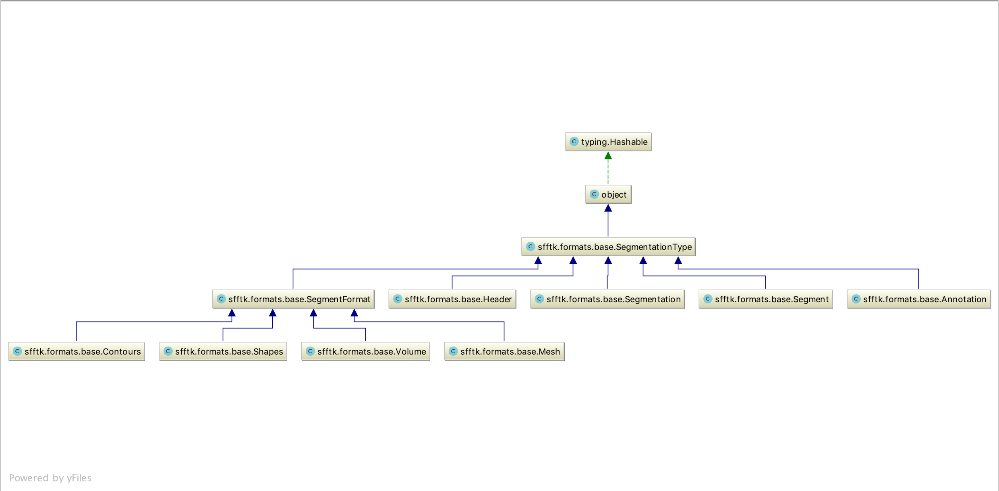

===============
Extending sfftk
===============

.. contents::

.. todo::

    multifile
    parser

Adding A Segmentation File Format
=================================

There are five (5) steps involved.

* Step I: Create a **reader** module

* Step II: Create a **format** adapter module

* Step III: Implement a **convert hook** in the :py:func:`sfftk.sff.handle_convert` function

* Step IV: Add test data files to the ``sfftk/test_data`` folder

* Step V: Add unit tests in the :py:mod:`sfftk.unittests` module

.. _step_I:

Step I: Create a **reader** module
------------------------------------

The role of the reader module is to be the first point of contact with the application-specific segmentation file.

Each reader module **must** implement a ``get_data(fn, *args, **kwargs)`` function which takes the segmentation file's name as a string together with optional positional and keyword arguments to be passed down the class chain. This function then returns a single *ad hoc* object that encapsulates the segmentation with a simple API faithful to the segmentation's structure to access various attributes of the segmentation e.g. ``headers``, ``segments`` etc.

The reader module **must** then be placed in the :py:mod:`sfftk.readers` package and should be named as the extension followed by the word 'reader' e.g. for Segger files with a ``.seg`` extension this would be ``segreader.py``.

.. _step_II:

Step II: Create a **format** adapter module
-----------------------------------------------------------

The format adapter is where the *ad hoc* segmentation object is *adapted* to the EMDB-SFF model.

The classes defined in this module represent a hierarchy describing a typical segmentation data structure. For the following discussion, please refer to the diagram below. (You might need to right-click and select an option to view the image in a new tab to see the image details.)

.. note::

    Note that all classes are subclasses of :py:class:`sfftk.formats.base.SegmentationType`, which *may* specify attributes and methods that apply to all subclasses. Currently, none are defined but it is envisaged that some may arise.

At the top of the hierarchy is a :py:class:`sfftk.formats.base.Segmentation` subclass which hosts objects of two other classes:

* a :py:class:`sfftk.formats.base.Header` subclass for all header related metadata such as segment colours, names, segmentation space parameters such as the bounding box etc., and

* an iterable attribute called ``segments`` which is a container for :py:class:`sfftk.formats.base.Segment` subclasses, each holding data for a single segment.

Each :py:class:`sfftk.formats.base.Segment` subclass will in turn host objects of the following classes:

* a :py:class:`sfftk.formats.base.Annotation` subclass for segment annotation, and

* one or more segment format subclasses: :py:class:`sfftk.formats.base.Volume` for 3D volumes, :py:class:`sfftk.formats.base.Mesh` for meshes, and/or :py:class:`sfftk.formats.base.Shapes` for shape primitives

Format adapter modules **must** be placed in the :py:mod:`sfftk.formats` package and should be named as the segmentation file format's extension e.g. for Segger files with a ``.seg`` extension this is ``seg.py``.

Conversion is effected within each class by implementing a ``convert()`` method which takes the attributes obtained from the *ad hoc* segmentation object and uses them to populate fields in a corresponding EMDB-SFF attribute object. Given the hierarchy described above, the ``convert()`` method for objects higher up in the hierarchy may then invoke the ``convert()`` method of lower level objects when effecting their conversions. An example will be provided below.

Example:
~~~~~~~~

To make the above concrete, we outline how the :py:mod:`sfftk.formats.seg` format adapter is implemented.

Segger segmentation files are represented using 3D volumes. Therefore, the :py:mod:`sfftk.formats.seg` module has the following top level structure:

.. code:: python

    from .base import Segmentation, Header, Segment, Annotation, Volume
    import sfftkrw as schema
    from ..readers import segreader

    class SeggerAnnotation(Annotation):
        pass

    class SeggerVolume(Volume):
        pass

    class SeggerSegment(Segment):
        pass

    class SeggerHeader(Header):
        pass

    class SeggerSegmentation(Segmentation):
        pass

The :py:class:`sfftk.formats.seg.SeggerSegmentation` class's initialiser does the reading using the :py:mod:`sfftk.readers.segreader` module described in :ref:`step_I`;

.. code:: python

    class SeggerSegmentation(Segmentation):
        def __init__(self, fn, top_level=False, *args, **kwargs):
            """Initialise the reader"""
            self._fn = fn
            self._segmentation = segreader.get_data(self._fn, *args, **kwargs)
            self._top_level = top_level

We then reference the ``header`` and ``segments`` attributes using propers to decouple the actual hosted objects from the user-facing attributes.

.. code:: python

    class SeggerSegmentation(Segmentation):
        # ...

        @property
        def header(self):
            """The header for this segmentation"""
            return SeggerHeader(self._segmentation)

and delegate the :py:class:`sfftk.formats.seg.SeggerHeader` to expose header attributes.

.. code:: python

    class SeggerHeader(Header):
        """Header class"""
        def __init__(self, segmentation):
            self._segmentation = segmentation

        @property
        def name(self):
            """The name of segmentation"""
            return self._segmentation.format

        @property
        def version(self):
            """The version of Segger used"""
            return self._segmentation.format_version

        @property
        def map_path(self):
            """The path to the original segmented map"""
            return self._segmentation.map_path

        @property
        def ijk_to_xyz_transform(self):
            """The image-to-physical transform"""
            return self._segmentation.ijk_to_xyz_transform

        @property
        def file_path(self):
            """The path to the .seg file"""
            return self._segmentation.file_path

        @property
        def root_parent_ids(self):
            """Parent IDs for root segments"""
            return self._segmentation.root_parent_ids

        @property
        def region_ids(self):
            """All region IDs"""
            return self._segmentation.region_ids

        @property
        def parent_ids(self):
            """All parent IDs"""
            return self._segmentation.parent_ids

        @property
        def map_size(self):
            """Map dimensions"""
            return self._segmentation.map_size

        @property
        def mask(self):
            return self._segmentation.mask

        @property
        def simplified_mask(self):
            return self._segmentation.simplify_mask(self.mask)

Notice that all underlying functionality is obtained from the *ad hoc* reader, which does the heavy lifting. The adapter merely *adapts* the *ad hoc* :py:class:`sfftk.readers.segreader.SeggerSegmentation` class for the EMDB-SFF schema.

Segments are contained in a list and exposed through the ``segments`` property of the :py:class:`sfftk.formats.seg.SeggerSegmentation` class.

.. code:: python

    class SeggerSegmentation(Segmentation):
        # ...

        @property
        def segments(self):
            """The segments in this segmentation"""
            if self._top_level:
                segments = [SeggerSegment(self._segmentation, region_id) for region_id in self.header.root_parent_ids]
            else:
                segments = [SeggerSegment(self._segmentation, region_id) for region_id in self.header.region_ids if
                            region_id != 0]
            return segments

To perform a conversion the :py:class:`sfftk.formats.seg.SeggerSegmentation` class implements a :py:meth:`sfftk.formats.seg.SeggerSegmentation.convert()` method that uses the EMDB-SFF schema API as described in :doc:`developing`.

.. code:: python

    class SeggerSegmentation(Segmentation):
        # ...

        def convert(self, args, *_args, **_kwargs):
            """Method to convert a :py:class:`sfftkrw.SFFSegmentation` object"""
            segmentation = schema.SFFSegmentation()
            segmentation.name = "Segger Segmentation"
            segmentation.software = schema.SFFSoftware(
                name=self.header.name,
                version=self.header.version,
            )
            segmentation.transforms = schema.SFFTransformList()
            segmentation.transforms.add_transform(
                schema.SFFTransformationMatrix(
                    rows=3,
                    cols=4,
                    data='1.0 0.0 0.0 1.0 0.0 1.0 0.0 1.0 0.0 0.0 1.0 1.0'
                )
            )
            segmentation.transforms.add_transform(
                schema.SFFTransformationMatrix(
                    rows=3,
                    cols=4,
                    data=" ".join(map(str, self.header.ijk_to_xyz_transform.flatten().tolist()))
                )
            )
            segmentation.primaryDescriptor = "threeDVolume"
            segments = schema.SFFSegmentList()
            for s in self.segments:
                segment = s.convert()
                segments.add_segment(segment)
            # finally pack everything together
            segmentation.segments = segments
            # lattice
            segmentation.lattices = schema.SFFLatticeList()
            cols, rows, sections = self.header.map_size
            lattice = schema.SFFLattice(
                mode='uint32',
                endianness='little',
                size=schema.SFFVolumeStructure(cols=cols, rows=rows, sections=sections),
                start=schema.SFFVolumeIndex(cols=0, rows=0, sections=0),
                data=self.header.simplified_mask
            )
            segmentation.lattices.add_lattice(lattice)
            # details
            if args.details is not None:
                segmentation.details = args.details
            elif 'details' in _kwargs:
                segmentation.details = _kwargs['details']
            return segmentation

Notice that in the loop for each segment (``for s in self.segments``) we refer to each segment's ``convert()`` method which is implemented as follows:

.. code:: python

    class SeggerSegment(Segment):
        # ...

        def convert(self, **kwargs):
            """Convert to a :py:class:`sfftkrw.SFFSegment` object"""
            segment = schema.SFFSegment()
            segment.id = self.region_id
            segment.parentID = self.parent_id
            # annotation
            segment.annotation, segment.colour = self.annotation.convert()
            # geometry
            # segment.volume = self.volume.convert()
            segment.volume = schema.SFFThreeDVolume()
            segment.volume.latticeId = 0
            segment.volume.value = self.region_id
            return segment

and which in turn calls the ``convert()`` methods on the contained annotation and volume objects.

.. _step_III:

Step III: Implement a **convert hook** in the :py:func:`sfftk.sff.handle_convert` function
------------------------------------------------------------------------------------------------

In order to perform conversion using the command-line utility, we need to have the ``convert`` utility recognise segmentations by file type. This is simply done by add adding a regular expression match object in the :py:func:`sfftk.sff.handle_convert()` function as follows:

.. code:: python

    def handle_convert(args, configs):  # @UnusedVariable
        # ...
        if args.multi_file:
            # segmentation file formats that support multi-file segmentations will be handled here
            # ...
        else:
            if re.match(r'.*\.mod$', args.from_file, re.IGNORECASE):
                # handle reading of IMOD files
            elif re.match(r'.*\.seg$', args.from_file, re.IGNORECASE):
                from .formats.seg import SeggerSegmentation
                seg = SeggerSegmentation(args.from_file, top_level=args.top_level_only)
            # other file formats go here
            else:
                raise ValueError("Unknown file type %s" % args.from_file)
        # export (convert first if needed)
        # ...
        sff_seg.export(args.output)

        return os.EX_OK

Once this is done the following should work:

.. code:: bash

    sff convert --top-level-only file.seg --verbose

.. _step_IV:

Step IV: Add test data files to the ``sfftk/test_data`` folder
---------------------------------------------------------------------

Provide an example segmentation file in the sfftk.test_data package.

.. _step_V:

Step V: Add unit tests in the :py:mod:`sfftk.unittests` module
----------------------------------------------------------------------------------------

Write unit tests and add them to the :py:mod:`sfftk.unittests.test_formats` module. Each format that you add should implement a read and convert test method (respectively called ``test_<format>_read`` and ``test_<format>_convert``. See the :py:mod:`sfftk.unittests.test_formats` module for examples.

Of course, you are welcome to contact us for help doing the above. Also, if you have any suggestions on how to improve the extension process these are invited.

Once all this components are in place conversion to XML, HDF5 and JSON should be automatic.

.. code:: bash

    sff convert file.<format> -f sff
    sff convert file.<format> -f hff
    sff convert file.<format> -f json

Also, tests can be run as follows:

.. code:: bash

    sff tests formats

Adding A Search Resource
=================================

The list of search resources is extensible. Any new search results must fulfil the following criteria:

*   Have a A REST API;

*   Return the result as either JSON or TAB-delimitted text;

Step I: Add the resource description
------------------------------------------------------------------------------------------------

The resource descriptions are contained in :py:mod:`sfftk.notes.__init__.py`. For example, the one for
`OLS <https://www.ebi.ac.uk/ols>`_ is:

.. code-block:: python

    RESOURCE_LIST['ols'] = {
        'name': 'OLS',
        'root_url': 'https://www.ebi.ac.uk/ols/api/',
        'format': 'json',
        'result_path': ['response', 'docs'],
        'result_count': ['response', 'numFound'],
    }

``RESOURCE_LIST`` is a dictionary whose primary key is the lower-case abbreviation of the resource name (``ols`` here).
Each resource's description is a dictionary of:

*   ``name`` - proper abbreviation of the resource's name (``UniProt`` not ``Uniprot``);

*   ``root_url`` - the part of the REST API which is invariant i.e. excluding search parameters;

*   ``format`` - either ``json`` or ``tab``;

*   ``result_path`` - the part of the response data that contains a list of results. In the above example,
    ``response``, ``docs`` are a path to a list element of the JSON where all results are found. If ``format`` is
    ``tab`` set this to ``None``.

*   ``result_count`` - the part of the response data that contains the count of the complete results. Usually only a
    page of all results is returned but it is useful to inform the user of how many results were found. If this is not
    present set it to ``None``.

Step II: Add a handler to return the correct URL
---------------------------------------------------------------------------------------------------------

Modify the :py:class:`sfftk.notes.find.SearchResults.get_url()` method by adding a conditional handler for
the resource that returns the complete search URL (i.e. including the search term and additional options allowed on the
REST API).

The ``if`` statement uses the resource name to identify the resource.

For example, the URL for OLS is generated as follows:

.. code-block:: python

        # ols
        if self.name == 'OLS':
            url = self.root_url + "search?q={}&start={}&rows={}".format(
                self.search_args.search_term,
                self.search_args.start - 1,
                self.search_args.rows,
            )
            if self.search_args.ontology:
                url += "&ontology={}".format(self.search_args.ontology)
            if self.search_args.exact:
                url += "&exact=on"
            if self.search_args.obsoletes:
                url += "&obsoletes=on"

Each of the subsequent ``if`` statements conditionally include additional parameters specified in the command-line
arguments.

Step III: Define how the table is formated
----------------------------------------------------------------------------------------------------------

The :py:meth:`sfftk.notes.find.SearchResource.tabulate()` specifies how to tabulate results from each resource. We use
two classes: :py:class:`sfftk.notes.find.TableField` and :py:class:`sfftk.notes.find.ResultsTable` to do this. Here is
an example for OLS:

.. code-block:: python

        if self._resource.name == 'OLS':
            fields = [
                    TableField(u'index', key=u'index', pc=5, is_index=True, justify=u'right'),
                    TableField(u'label', key=u'label', pc=10),
                    TableField(u'resource', key=u'ontology_name', pc=5, justify=u'center'),
                    TableField(u'url', key=u'iri', pc=30),
                    TableField(u'accession', key=u'short_form', pc=10, justify=u'center'),
                    TableField(u'description', key=u'description', pc=40, is_iterable=True),
                ]
            table += _str(ResultsTable(self, fields=fields))

You will need to refer to the resource's REST API documentation to match result fields with table fields.

:py:class:`sfftk.notes.find.TableField` accepts the following arguments:

*   The first (positional) argument is the name of the field and appears in the table header;

*   ``key`` is the official name of the field in the REST API; the :py:class:`sfftk.notes.find.TableField` uses the key
    to extract the row values;

*   Instead of using the ``key`` argument, the user may use ``text`` which will be a fixed value for all rows;

*   ``pc`` is the field width in *percent*; alternatively, use the ``width`` argument to specify how many characters
    wide the field should be;

*   ``is_index`` sets the field to be an index field i.e. to show the row number;

*   ``justify`` can either be ``right``, ``left`` or ``center`` and specifies the field text alignment;

*   ``_format`` specifies a *format string* (a string with with ``{}`` which will replace ``{}`` with the field value.
    This is helpful when creating URLs/IRIs to an accession page e.g.

    .. code-block:: python

         TableField('url', key='EntryID', _format='https://www.ebi.ac.uk/pdbe/emdb/EMD-{}', pc=30),

    for an EMDB entry page.

Step IV: Write tests and test
------------------------------------------------------------------------------------------------

You will then need to write at least two tests in the ``sfftk.unittests.test_notes.TestNotesFindSearchResource`` class:

*   *parser* tests that check that the command-line arguments are correct (see the module for other examples);

*   *get_url* tests that ensure that the URL is correctly formed for all options;

Step IV: Write documentation for the new resource
------------------------------------------------------------------------------------------------

Finally, document the resource in the section :ref:`specifying-the-resource-to-search` by describing the following:

*   the *name* and *link to* the resource in the list of resources;

*   the *keyword* to be passed to the ``-R/--resource`` flag;
